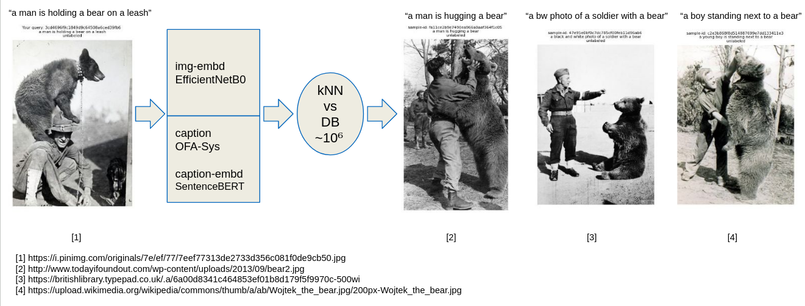

# celador
Built a tool to index images based on visual and semantic (caption) similarity.

Aimed at 100k+ images scraped with Bing Image Downloader, DuckDuckGo or any other mass downloader of your choice. 

Image embeddings through EfficientNetB0, captioning via OFA-Sys-large mLLM, and embedding the caption via SentenceBert.

Building lookup kNN clustering index via faiss library on image, caption, and combined embedding level.

Enables retrieval of matching samples in large-scale image databases, based on visual and semantic similarity.

